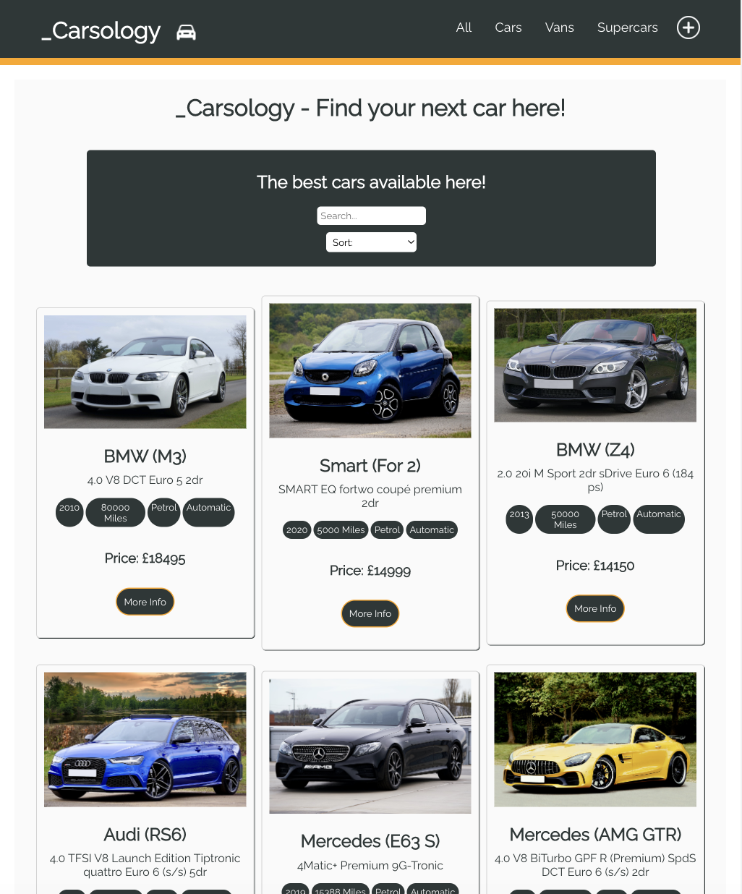
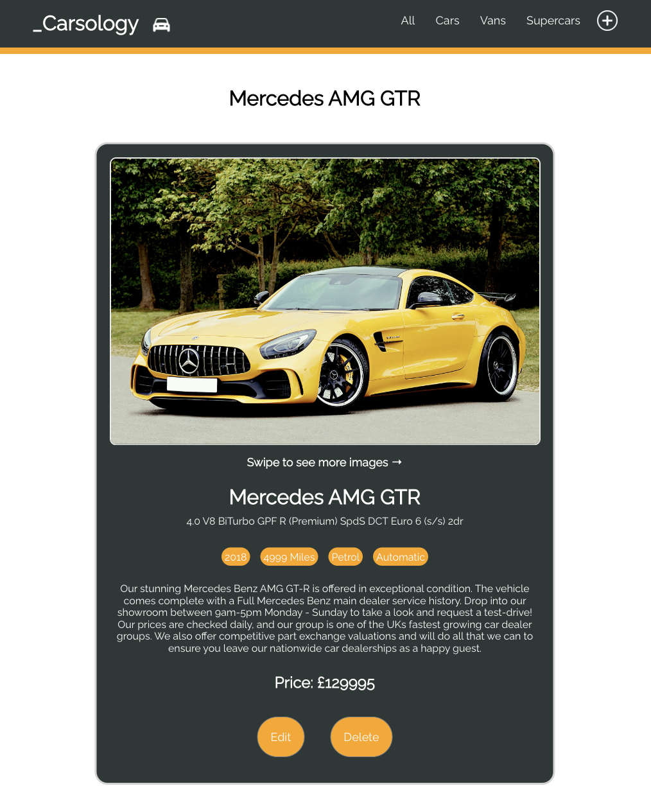
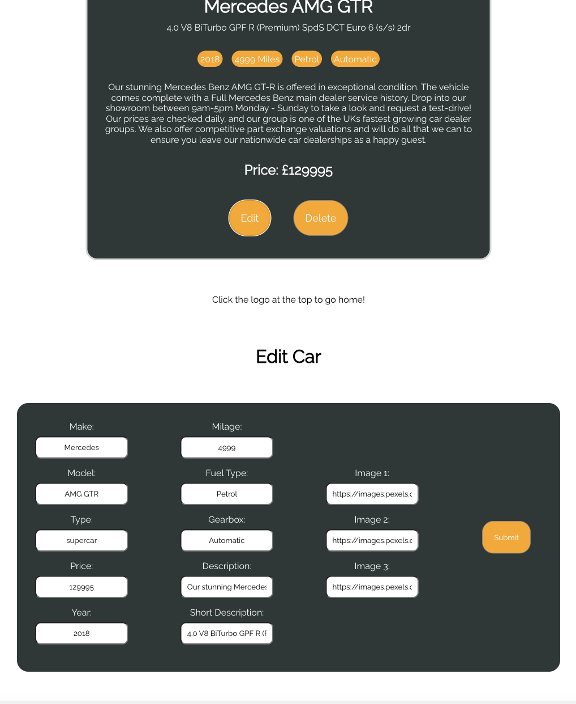

<h1 align="center">Hi 👋, I'm Andrew</h1>
<h2 align="center">Welcome to my final Full-Stack Project for _Nology.</h2>

My final project is based around a car sale website. It has both user facing content and is fully CRUD responsive. Once on the website you will be greeted with a list of cars for sale (As seen in the first image below on the left). The cars can be searched for by name using the search feature, sorted using the drop down menu and in the top right filtered by type. When you click on a car you will be greeted with more detailed information and the options to edit & delete the car (The middle image below). 

To use the edit feature you can click the edit button, then a form will dropdown below displaying the data that can be changed. Once you have made the changed an alert will be shown and the car will be changed, the user will be returned to the home page(The last image on the right below).

To add a new car to the database you can click the + in the top right corner of the page. This will bring up a similar blank form which all new details can be added.

This project was challenging as it takes all of my knowledge from the 12 weeks on the course and puts it in one place. My favourite parts of the projects were creating the designs and the react page as well as getting the pagination to work. The harder parts were getting the edit and add feature to work. It was a big learning curve but I am very pleased with the outcome. 

Going forward I will continue to work on the project. I want to learn how to add a login page for the user as well as host the database in a cloud storage solution

If you have any feedback please connect with me on LinkedIn as I would love to hear it!

<h3 align="center">Languages and Tools used:</h3>

             

<h3 align="center">Connect with me:</h3>

<h1>                                                                                                                                 </h1>
<h1>                                                                                                                                 </h1>

<h1>                                                                                                                                 </h1>
<h1>                                                                                                                                 </h1>
